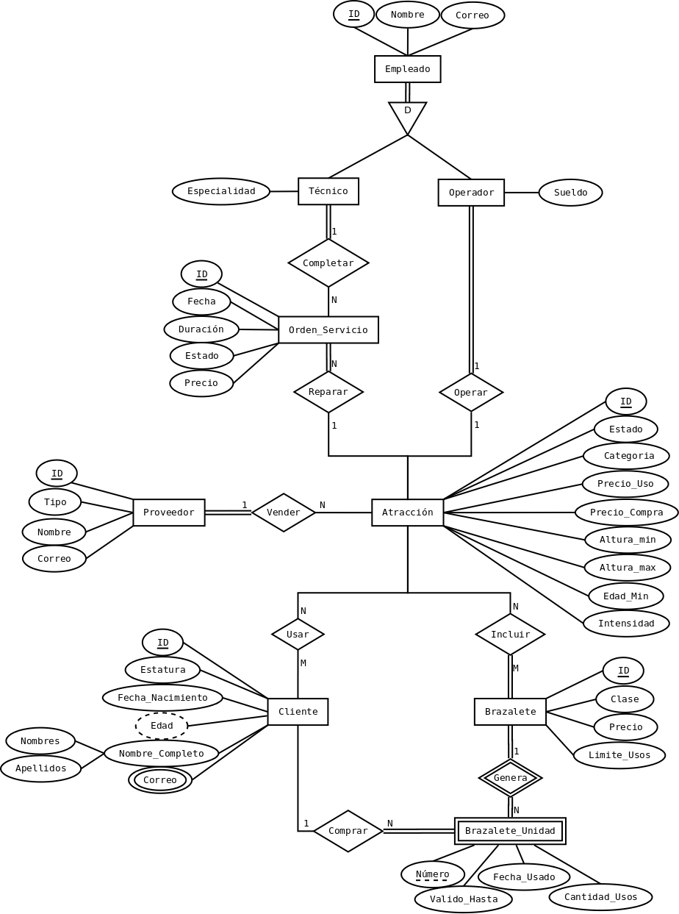

# Solución taller #2 MR Parque Norte

1. Verificar el modelo entidad relación realizado en la actividad anterior.

Actualizo el modelo entidad relación para volverlo extendido y documentarlo para consulta de personal no técnico.

### Entidades y sus atributos

1. **Cliente**
   - ID (Llave)
   - Estatura
   - Fecha_Nacimiento
   - Edad (Derivado)
   - Nombre_Completo (Compuesto de: Nombres, Apellidos)
   - Correo (multivaluado)
2. **Brazalete (Entidad Fuerte)**
   - ID (Llave)
   - Clase
   - Precio
   - Límite_Usos
3. **Brazalete_Unidad (Entidad Debil)**
   - Número (Discriminador)
   - Valido_Hasta
   - Fecha_Usado
   - Cantidad_Usos
4. **Atracción**
   - ID (Llave)
   - Estado
   - Categoria
   - Precio_Uso
   - Precio_Compra
   - Altura_Min
   - Altura_Max
   - Edad_Min
   - Intensidad
5. **Proveedor**
   - ID (Llave)
   - Tipo
   - Nombre
   - Correo
6. **Orden_Servicio**
   - ID (Llave)
   - Fecha
   - Duración
   - Estado
   - Precio
7. **Empleado (SuperEntidad Disyuntiva)**
   - ID (Llave)
   - Nombre
   - Correo
8. **Operador (SubEntidad de Empleado)**
   - Sueldo
9. **Técnico (SubEntidad de Empleado)**
   - Especialidad

### Relaciones, cardinalidad y participación

#### Muchos a Muchos

- Un cliente puede **usar muchas** atracciones y una atracción puede **ser utilizada por muchos** clientes. Los clientes pueden **no usar** las atracciones y una atracción nueva puede **no haber sido usada** aún por clientes.
- Un brazalete puede **incluir muchas** atracciones y una atracción puede **estar incluida en varios** brazaletes. Un brazalete **debe incluir** atracciones, sin embargo una atracción **no necesita estar incluida** en un brazalete.

#### Uno a Muchos

- Un cliente puede **comprar muchas** unidades de brazalete, pero una unidad de brazalete puede **ser comprada por solo un** cliente. Los clientes pueden **no comprar** unidades de brazaletes y una unidad de brazalete **tiene que ser comprado por un** cliente.
- Un brazalete puede **generar muchas** unidades y una unidad puede **ser generada de solo un** brazalete. Un brazalete **debe tener** unidades, y las unidades **tienen que ser generadas de un** brazalete.
- Un proveedor puede **vender muchas** atracciones y una atracción puede **ser vendida por solo un** proveedor. Un proveedor **debe haber vendido una** atracción y una atracción puede **no haber sido vendida** por un proveedor.
- Una atracción puede **ser reparada con muchas** ordenes de servicio y una orden de servicio **solo puede ser para reparar una** atracción. Una atracción no necesita tener una orden de servicio, mientras que una orden de servicio **debe ser para reparar una** atracción.
- Un tecnico puede **completar muchas** ordenes de servicio y una orden de servicio puede **ser completada por solo un** técnico. Un técnico **debe haber completado una** orden de servicio, mientras que una orden puede **no ser completada por un** técnico (suponiendo que se cancele la orden, o no hay técnicos disponibles).

#### Uno a Uno

- Un operador puede **operar solo una** atracción y una atracción puede **ser operada por solo un** operador. Un operador **tiene que operar una** atracción, mientras que una atracción puede **no ser operada por un** operador.